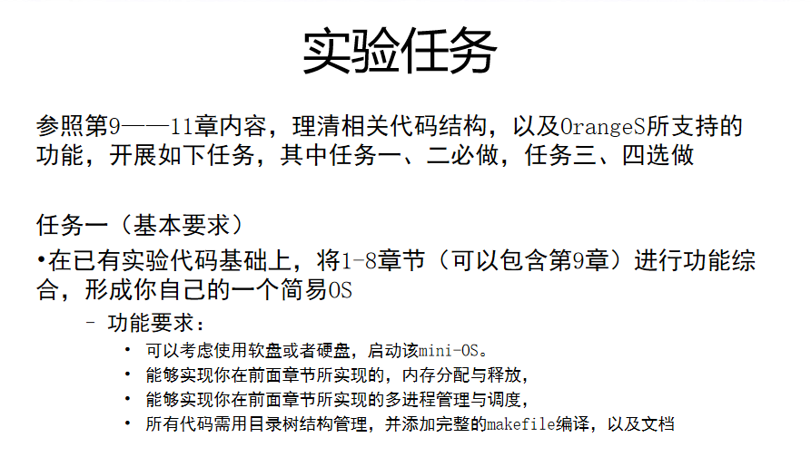
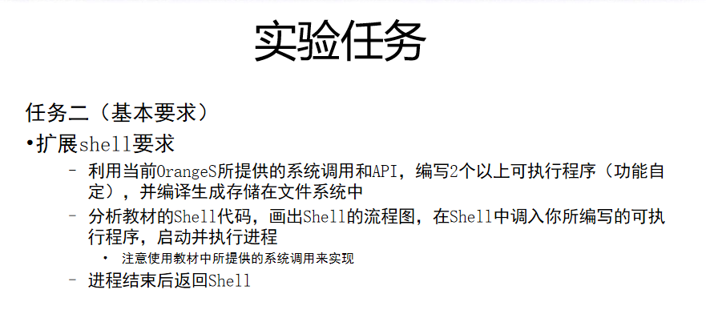
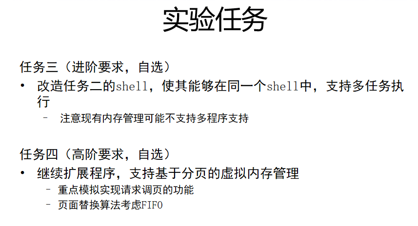
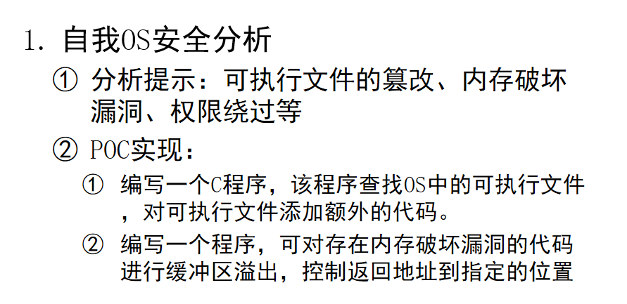

# OrangeOS设计
武汉大学21级网安操作系统大作业

代码为个人负责的实验部分

# 任务介绍

# 文件介绍
**task1_v1**
对应任务一的第一个版本，这是在第十章e的基础上做的，多级队列调度功能存在问题，其他功能完善

make image后bochs即可

**task1_v2**
对应任务一的第二个版本，这是在第六章的基础上做的，功能完善，make image后bochs即可

**task2**
对应任务二，这是在第十一章a的基础上做的，添加了test、echo、touch、rm、ls、cat、cp七条指令
            make image & cd command & make & make install & cd .. & bochs 即可运行

**task3**
对应任务三，在任务二的基础上做的，可以多任务达五条

make image & cd command & make & make install & cd .. & bochs 即可运行

**task5_1_3**
对应任务五的格式化字符串漏洞和栈溢出漏洞，在任务三的基础上做的

``test1 %d`` 即可实现格式化字符串漏洞

``test3`` 即可实现栈溢出漏洞

make image & cd command & make & make install & cd .. & bochs 即可运行

**task5_2_v1**
对应任务五的可执行化文件的第一个方法，在任务三的基础上做的

make image & cd command & make & make install & cd .. & bochs 即可运行

``test2``执行

**task5_2_v2**
对应任务五的可执行化文件的第二个方法，在任务三的基础上做的

make image & cd command & make & make install & cd .. & bochs 即可运行

``test2``执行